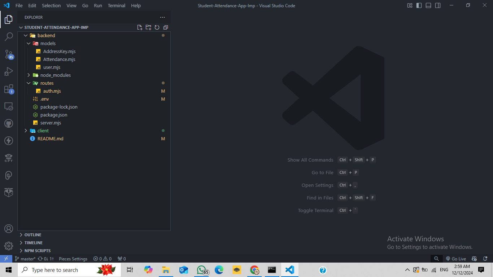
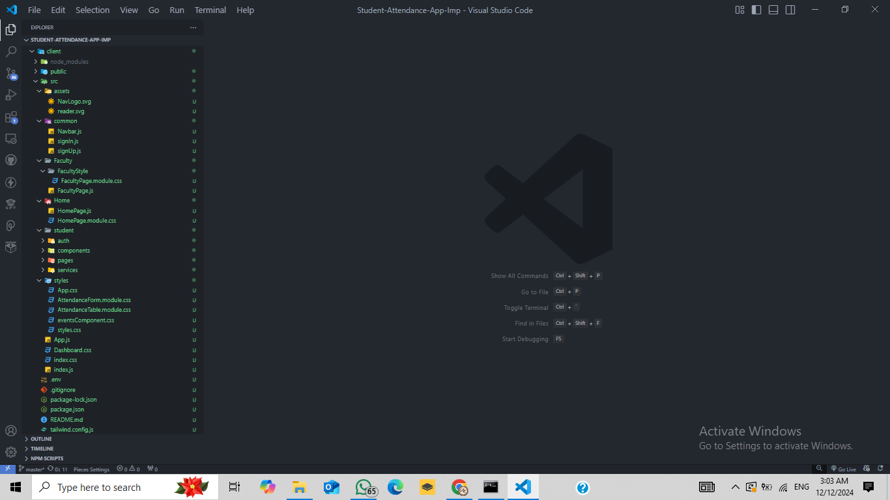

##  NECCESSARY FRONTEND PACKAGES TO INSTALL ##
``` 
npm install @emotion/react@^11.11.4 \
@emotion/styled@^11.11.5 \
@fortawesome/fontawesome-free@^6.5.2 \
@here/maps-api-for-javascript@^1.54.2 \
@mui/icons-material@^5.15.21 \
@mui/material@^5.15.21 \
@mui/styles@^5.16.0 \
@react-google-maps/api@^2.19.3 \
@tailwindcss/forms@^0.5.7 \
@testing-library/jest-dom@^5.17.0 \
@testing-library/react@^13.4.0 \
@testing-library/user-event@^13.5.0 \
axios@^1.7.2 \
bootstrap@^5.3.3 \
dotenv@^16.4.5 \
file-saver@^2.0.5 \
jspdf@^2.5.1 \
jspdf-autotable@^3.8.2 \
leaflet@^1.9.4 \
mdb-react-ui-kit@^8.0.0 \
moment@^2.30.1 \
react@^18.3.1 \
react-big-calendar@^1.13.0 \
react-bootstrap@^2.10.2 \
react-dom@^18.3.1 \
react-leaflet@^4.2.1 \
react-router-dom@^6.24.1 \
react-scripts@5.0.1 \
react-table@^7.8.0 \
text@^0.1.0 \
web-vitals@^2.1.4 \
xlsx@^0.18.5 \
tailwindcss@^3.4.4
```

## BACKEND PACKAGES ##
```
npm install axios@^1.7.2 body-parser@^1.20.2 cors@^2.8.5 dotenv@^16.4.5 express@^4.19.2 html-pdf@^3.0.1 json2csv@^6.0.0-alpha.2 leaflet@^1.9.4 mongoose@^8.4.1 nanoid@^5.0.7 react-leaflet@^4.2.1

```

## PARTITION OF PROJECT ##
```
Project is divided into 2 parts:
1. BACKEND
2. CLIENT (FRONTEND)
```
## BACKEND FOLDER STRUCTURE LOOK LIKE THIS: 


## CLIENT FOLDER STRUCTURE LOOK LIKE THIS: 
"# ProxyLess-Attendance-System" 
